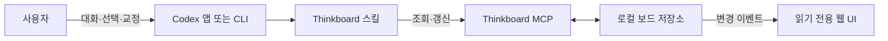

# Thinkboard Codex 대화 연동 및 읽기 전용 시각화 개발 문서

## 1. 문서 목적

이 문서는 공식 Codex 앱 또는 CLI에서 Thinkboard 대화를 진행하고, 로컬 웹 UI는 그 대화에서 만들어진 보드를 실시간으로 보여주는 읽기 전용 시각화 도구로 단순화하는 개발 방향을 정의한다.

핵심 목적은 지원되지 않는 데스크톱 앱 메시지 주입을 우회하는 복잡한 브리지를 만들지 않고도 다음 경험을 안정적으로 제공하는 것이다.

- 사용자는 익숙한 Codex 대화창에서 질문, 빠른 선택, 도구 사용과 승인을 처리한다.
- Codex는 대화의 의미를 카드와 관계로 자동 정리한다.
- 웹 UI는 같은 로컬 보드를 즉시 시각화한다.
- 사용자는 관계선을 직접 관리하지 않는다.

관련 문서:

- [제품 원칙](./PRODUCT.md)
- [보드 모델](../plugins/codex-thinkboard/skills/thinkboard/references/board-model.md)
- [Codex app-server 공식 문서](https://developers.openai.com/codex/app-server)

## 2. 한 줄 제품 정의

Thinkboard는 Codex 대화에서 정리된 원하는 것, 모르는 것, 근거와 가정을 실시간으로 보여주는 로컬 읽기 전용 시각화 보드다.

## 3. 현재 문제

현재 Thinkboard 웹 UI는 카드 문장과 상태를 수정할 수 있지만, 웹에서 한 수정이 이미 진행 중인 공식 Codex 데스크톱 앱 대화에 즉시 새 메시지로 들어가지는 않는다.

완전한 양방향 동기화를 위해 별도의 Codex app-server 클라이언트와 대화 UI를 만들 수는 있다. 그러나 이 방식에는 다음 비용과 불확실성이 있다.

- 웹 채팅, 스트리밍, 질문, 승인, 도구 진행 UI를 새로 구현해야 한다.
- WebSocket app-server 전송은 현재 실험적이다.
- 공식 Codex 데스크톱 앱의 현재 대화창과 동일 스레드를 공유하는 공개 플러그인 인터페이스가 확인되지 않았다.
- 별도 app-server 스레드는 사용자가 현재 보고 있는 앱 대화와 분리될 수 있다.
- 인증, 권한, 프로세스 소유권, 재연결과 중복 응답 처리가 크게 복잡해진다.

이 복잡성은 Thinkboard의 핵심 가치인 `대화를 이해하기 쉽게 시각화한다`는 목표보다 크다. 따라서 첫 제품 방향은 양방향 웹 채팅이 아니라 읽기 전용 시각화로 고정한다.

## 4. 핵심 제품 결정

### 4.1 Codex가 유일한 대화 화면이다

질의응답은 공식 Codex 앱 또는 CLI에서 진행한다.

사용자는 Codex가 제공하는 다음 기능을 그대로 사용한다.

- 자유 입력
- 예상 질문과 빠른 선택지
- 직접 입력 선택지
- 파일과 코드 작업
- MCP와 플러그인 도구
- 명령 및 파일 변경 승인
- 진행 상황과 최종 응답

Thinkboard 웹에 별도의 채팅 입력창을 만들지 않는다.

### 4.2 웹은 의미 상태를 읽기 전용으로 표시한다

웹 UI는 카드와 관계의 의미를 직접 수정하지 않는다.

읽기 전용 대상:

- 카드 문장
- 카드 종류
- 카드 상태
- 카드 사이의 관계
- 보드 단계와 제목

사용자가 웹에서 변경할 수 있는 것은 의미가 아닌 표현 설정뿐이다.

- 확대와 축소
- 화면 이동
- 카드의 시각적 위치
- 언어 설정
- 사이드 패널 열기와 닫기

### 4.3 카드와 관계는 Codex가 자동 관리한다

Codex는 사용자 답변을 바탕으로 카드와 관계를 만들고, 수정하고, 해결하거나 제외한다.

사용자는 관계선을 직접 연결하지 않는다. 관계가 잘못됐으면 Codex 대화창에서 자연어로 교정한다.

예:

> 야식 조절 여부가 감량 자체보다 감량 후 유지에 더 영향을 주는 것 같아.

Codex는 이 교정을 해석해 보드 관계를 다시 저장한다.

### 4.4 빠른 선택은 Codex 네이티브 UI를 사용한다

Thinkboard 스킬은 실제 선택지가 있는 질문에 Codex의 사용자 입력 요청 기능을 우선 사용한다.

사용자는 Codex 앱 또는 CLI에서 다음 형태로 답한다.

- 권장 선택지가 먼저 보이는 2~3개의 빠른 선택지
- 선택지별 짧은 영향 설명
- 항상 사용할 수 있는 직접 입력

웹 UI는 질문이나 선택지를 복제하지 않는다.

### 4.5 보드가 시각적 정본이다

대화 기록은 Codex 작업이 소유하고, 카드와 관계는 로컬 Thinkboard 보드가 소유한다.

Codex가 보드 MCP 도구를 통해 변경을 저장한 뒤 웹이 같은 데이터를 읽는다. 웹이 대화 기록을 복제하거나 자체 대화 상태를 만들지 않는다.

## 5. 지원 범위

| 화면 또는 기능 | 목표 경험 | 첫 출시 범위 |
| --- | --- | --- |
| 공식 Codex 데스크톱 앱 | 대화, 빠른 선택, Codex 도구와 승인 | 지원 |
| Codex CLI | 대화, 빠른 선택, Codex 도구와 승인 | 지원 |
| Thinkboard 웹 UI | 보드 실시간 시각화와 표현 설정 | 지원 |
| 웹 카드 의미 편집 | 문장, 종류, 상태, 관계 직접 변경 | 미지원 |
| 웹 채팅 | 웹에서 Codex와 직접 대화 | 미지원 |
| 웹과 Codex 앱의 동일 대화 스레드 | 양쪽에서 메시지 입력과 응답 공유 | 요구하지 않음 |
| 비공식 Codex 앱 내부 연결 | 내부 소켓, 세션 파일 또는 UI 자동화 | 금지 |

Codex 앱과 CLI가 동일 대화 기록을 공유하는지는 Codex 작업과 세션 선택에 따른다. Thinkboard가 보장하는 공유 대상은 로컬 보드 상태다.

## 6. 목표 UX 흐름

### 6.1 시작

1. 사용자가 Codex 앱이나 CLI에서 Thinkboard를 호출한다.
2. Codex가 현재 로컬 보드를 읽는다.
3. Codex가 보드 주소를 열거나 사용자에게 알려준다.
4. 웹에는 현재 카드와 관계가 표시된다.
5. 대화는 계속 Codex 화면에서 진행한다.

### 6.2 질문과 빠른 선택

1. Codex가 사용자의 말을 한 문장으로 반영한다.
2. 답에 따라 달라질 가장 중요한 질문 하나를 고른다.
3. 실제 선택지가 있으면 네이티브 빠른 선택 UI를 표시한다.
4. 사용자가 선택하거나 직접 입력한다.
5. Codex가 의미 있는 카드와 관계만 갱신한다.
6. 웹 보드가 자동으로 바뀐다.

### 6.3 자연어 교정

1. 사용자가 웹에서 잘못된 카드나 관계를 발견한다.
2. 사용자는 Codex 대화창에서 자연어로 잘못된 의미를 설명한다.
3. Codex가 교정 내용을 확인한다.
4. Codex가 보드를 갱신한다.
5. 웹은 교정된 보드를 즉시 표시한다.

사용자가 카드 식별자를 입력하지 않아도 되도록 Codex는 카드의 문장과 현재 집중 대상을 기준으로 교정을 해석한다. 같은 문장의 카드가 여러 개면 짧은 확인 질문을 한다.

### 6.4 대화 종료

Codex는 다음 조건을 만족할 때 보드를 `ready` 단계로 전환한다.

- 구체적인 원하는 결과가 확인됐다.
- 중요한 비목표가 확인됐다.
- 남은 미지에 우선순위가 있다.
- 근거와 가정이 구분됐다.
- 다음 행동 또는 작은 실험이 하나 정해졌다.

웹은 최종 보드를 결과 화면처럼 유지한다.

## 7. 화면 구조

읽기 전용 전환 후 웹은 보드에 더 많은 공간을 사용한다.

```text
┌──────────────────────────────────────────────────┐
│ Thinkboard     한국어/English     Codex와 연결됨 │
├──────────────────────────────────────────────────┤
│                                                  │
│          카드와 관계의 실시간 시각화             │
│                                                  │
│   원하는 것     모르는 것     근거     가정      │
│                                                  │
├──────────────────────────────────────────────────┤
│ 마지막 갱신 · 현재 단계 · 카드 수 · 관계 수     │
└──────────────────────────────────────────────────┘
```

카드를 선택하면 편집창 대신 설명 패널을 표시한다.

- 카드 종류의 뜻
- 현재 상태의 뜻
- 연결된 카드와 관계의 자연어 설명
- `Codex에서 이 내용 수정하기` 안내

앱으로 메시지를 직접 보내는 기능이 공식 제공되기 전까지, 안내는 복사 가능한 교정 문장 예시만 제공한다.

## 8. 상태 의미

### 8.1 카드 상태

| 상태 | 사용자 의미 |
| --- | --- |
| 검토 중 | 아직 사용자가 확인하지 않은 후보 |
| 확정 | 사용자가 의미를 확인한 내용 |
| 해결됨 | 답을 찾았거나 더 이상 열린 문제로 다루지 않는 내용 |
| 제외됨 | 현재 판단에서 사용하지 않는 내용 |

`resolved`는 주로 `unknown`에 사용한다. 목표가 달성됐다는 의미가 필요하면 별도의 완료 개념을 도입하기 전까지 카드 문장과 보드 단계로 표현한다.

### 8.2 관계 의미

관계선에는 기계적인 이름만 표시하지 않고 자연어 설명을 제공한다.

- `depends_on`: 이 결과를 위해 다른 조건이 필요함
- `blocks`: 이 미지가 목표 결정을 막고 있음
- `contradicts`: 같은 조건에서 두 내용이 함께 성립하기 어려움
- `resolves`: 이 근거나 답이 미지를 해결함

## 9. 시스템 구조

### 9.1 전체 구조



### 9.2 Codex 앱 또는 CLI

책임:

- 사용자와의 모든 대화
- 빠른 선택과 직접 입력
- Codex 도구 실행과 승인
- Thinkboard 스킬 적용
- 보드 의미 갱신 요청

### 9.3 Thinkboard 스킬

책임:

- 대화에서 2~4개의 핵심 카드만 추출
- 가장 영향이 큰 질문 하나 선택
- 사용자 답변 후 보드 갱신
- 확인하지 않은 추론을 가정으로 유지
- 모든 활성 미지를 관련 목표에 연결
- 웹에서 직접 수정한 의미가 없다는 읽기 전용 전제 유지

### 9.4 Thinkboard MCP

책임:

- 현재 보드 읽기
- 보드 모델 검증
- 원자적인 보드 저장
- 변경 이벤트 발생
- 로컬 보드 주소 제공

### 9.5 읽기 전용 웹 UI

책임:

- 카드와 관계 렌더링
- 보드 변경 이벤트 구독
- 연결 상태와 마지막 갱신 표시
- 카드 의미 설명
- 언어와 레이아웃 같은 표현 설정 저장

웹은 보드 의미 변경 요청을 보내지 않는다.

## 10. 상태와 소유권

| 상태 | 정본 소유자 | 저장 위치 | 갱신 계기 |
| --- | --- | --- | --- |
| 사용자와 Codex의 대화 | Codex 작업 | Codex 세션 | 사용자가 메시지 또는 선택지 제출 |
| 카드와 관계 | Thinkboard MCP | 로컬 보드 JSON | Codex가 보드 갱신 도구 호출 |
| 보드 단계와 제목 | Thinkboard MCP | 로컬 보드 JSON | 대화 단계 변화 |
| 카드 위치 | 브라우저 | localStorage | 사용자가 화면 배치 변경 |
| 언어 설정 | 브라우저 | localStorage | 사용자가 언어 변경 |
| 연결 상태 | 웹 UI | 메모리 | 서버 또는 이벤트 연결 변화 |

대화와 보드는 서로 다른 정본을 가지지만, Thinkboard 스킬은 매 대화 재개 시 보드를 먼저 읽어 둘의 의미가 어긋나지 않게 한다.

## 11. 동기화 규칙

### 11.1 Codex에서 웹으로

1. Codex가 보드 갱신 MCP 도구를 호출한다.
2. MCP가 전체 보드를 검증한다.
3. 로컬 파일을 원자적으로 교체한다.
4. 웹 서버가 보드 변경 이벤트를 보낸다.
5. 웹이 새 보드를 다시 읽고 렌더링한다.

정상 환경에서는 보드 저장 후 500ms 안에 웹에 반영하는 것을 목표로 한다.

### 11.2 웹에서 Codex로

의미 상태는 전송하지 않는다. 웹에서 바꿀 수 있는 레이아웃과 언어는 Codex 대화에 영향을 주지 않는다.

사용자가 의미를 교정하려면 Codex 대화창을 사용한다.

### 11.3 재개

Thinkboard 스킬은 새 대화나 재개된 대화에서 다음 순서를 따른다.

1. 현재 보드를 읽는다.
2. 마지막 대화 입력과 현재 보드의 차이를 확인한다.
3. 새 답변이 의미를 바꿀 때만 보드를 갱신한다.
4. 보드 갱신 후 다음 질문을 한다.

## 12. 오류와 복구 UX

### 12.1 웹 연결 실패

- 웹은 `보드 서버에 연결할 수 없음`을 표시한다.
- 사용자는 Codex 대화를 계속할 수 있다.
- 웹은 짧은 간격으로 재연결을 시도한다.
- 수동 새로고침 버튼을 제공한다.

### 12.2 MCP 또는 보드 저장 실패

- Codex는 보드가 갱신됐다고 주장하지 않는다.
- 대화는 Markdown 보드 폴백으로 계속한다.
- 사용자는 실패한 보드 갱신과 대화 답변을 구분할 수 있어야 한다.
- 저장소 복구 후 전체 보드를 다시 동기화한다.

### 12.3 웹 서버 소유 프로세스 종료

- 다른 MCP 프로세스가 로컬 포트를 자동 인계한다.
- 웹은 재연결 후 최신 전체 보드를 다시 읽는다.
- 이벤트 유실을 추측으로 보충하지 않는다.

### 12.4 오래된 웹 화면

- 마지막 갱신 시간을 표시한다.
- 이벤트 연결이 끊기면 `실시간 갱신 중지` 상태를 보여준다.
- 주기적인 전체 보드 재조회로 이벤트 누락을 보완한다.

## 13. 보안과 개인정보

- 웹 서버는 loopback 주소에만 바인딩한다.
- 웹에는 Codex 인증 정보가 전달되지 않는다.
- 웹은 명령 실행과 파일 변경 기능을 갖지 않는다.
- HTTP Host를 검증한다.
- 읽기 전용 API에도 캐시 금지와 콘텐츠 보안 헤더를 유지한다.
- 카드와 대화 원문을 외부 서비스로 전송하지 않는다.
- 로그에는 보드 원문을 기본 기록하지 않는다.
- 원격 접속과 다중 사용자 공유는 지원하지 않는다.

읽기 전용 구조는 브라우저에서 Codex 권한과 인증을 다뤄야 하는 위험을 제거한다.

## 14. 비기능 요구사항

### 14.1 성능

- 보드 저장 후 웹 반영은 정상 환경에서 500ms 이내를 목표로 한다.
- 카드 위치 이동 중 전체 보드 데이터를 저장하지 않는다.
- 카드 수가 늘어도 대화 응답에는 영향을 주지 않아야 한다.
- 보드가 커지면 현재 집중 카드와 활성 카드만 강조한다.

### 14.2 접근성

- 카드 종류와 상태를 색상만으로 구분하지 않는다.
- 카드와 관계를 키보드로 탐색할 수 있어야 한다.
- 관계의 자연어 설명을 제공한다.
- 한국어와 영어 UI를 모두 제공한다.
- 실시간 갱신 알림이 스크린 리더를 반복적으로 방해하지 않아야 한다.

### 14.3 호환성

- 웹을 열지 않아도 Thinkboard 대화와 MCP가 동작한다.
- MCP가 없어도 Markdown 보드 폴백을 사용할 수 있다.
- 기존 보드 JSON 형식을 유지한다.
- 앱과 CLI에서 같은 Thinkboard 스킬 규칙을 사용한다.

## 15. 개발 단계

### 단계 0: 읽기 전용 제품 범위 고정

목표:

- 웹 의미 편집과 웹 채팅을 첫 출시 범위에서 제거
- Codex 대화를 유일한 입력 경로로 문서화
- 제품 문서와 스킬 규칙을 일치시킴

완료 조건:

- 지원 범위에 양방향 앱 스레드 공유가 포함되지 않는다.
- 사용자가 관계선을 직접 편집할 필요가 없다.
- 웹에서 가능한 표현 변경과 불가능한 의미 변경이 구분된다.

### 단계 1: 웹 읽기 전용 전환

목표:

- 카드 문장 저장과 상태 변경 컨트롤 제거
- 설명 패널과 마지막 갱신 상태 추가
- 언어, 확대, 이동, 레이아웃 기능 유지

완료 조건:

- 웹 API를 통해 의미 보드를 변경할 수 없다.
- 카드를 선택하면 편집 UI가 아니라 의미 설명이 나타난다.
- 기존 한국어와 영어 표시가 유지된다.

### 단계 2: Codex 대화와 보드 갱신 규율 강화

목표:

- 매 답변 후 의미가 바뀔 때만 보드 갱신
- 실제 선택지가 있는 질문에 네이티브 빠른 선택 사용
- 자연어 교정을 카드와 관계에 안정적으로 반영

완료 조건:

- 사용자는 Codex 대화만으로 카드와 관계를 교정할 수 있다.
- 모든 활성 미지가 관련 목표에 연결된다.
- 확인하지 않은 해석은 가정 또는 검토 중 상태로 남는다.

### 단계 3: 실시간 시각화 신뢰성

목표:

- 저장 이벤트와 웹 갱신 지연 측정
- 이벤트 누락 시 전체 재조회
- 서버 소유권 자동 인계와 재연결

완료 조건:

- Codex의 보드 갱신이 정상 환경에서 500ms 안에 웹에 나타난다.
- 서버 소유 프로세스를 종료해도 대기 프로세스가 웹을 복구한다.
- 재연결 후 최신 전체 보드와 화면이 일치한다.

### 단계 4: 시각화 UX 개선

목표:

- 관계의 자연어 설명
- 현재 질문과 관련된 카드 집중 표시
- 변경된 카드의 짧은 시각적 강조
- 완료 보드의 결과 보기

완료 조건:

- 사용자가 선 종류를 몰라도 관계 의미를 이해할 수 있다.
- 새로 바뀐 카드와 현재 집중 카드를 구분할 수 있다.
- 보드가 대화를 방해하지 않고 옆에서 이해를 돕는다.

### 단계 5: 공식 호스트 연동 재검토

공식 Codex 앱이 플러그인 웹 UI와 현재 스레드를 연결하는 공개 인터페이스를 제공할 때만 양방향 대화를 다시 검토한다.

재검토 조건:

- 현재 Codex 앱 스레드 식별자를 안전하게 전달할 수 있다.
- 플러그인이 공식 방식으로 사용자 메시지를 제출할 수 있다.
- 질문, 승인과 스트리밍 이벤트를 공식 방식으로 구독할 수 있다.
- 브라우저가 Codex 인증 정보를 직접 보유하지 않아도 된다.

조건을 만족하지 않으면 읽기 전용 구조를 유지한다.

## 16. 테스트 전략

### 16.1 계약 테스트

- 보드 조회 API가 유효한 보드 모델만 반환한다.
- 읽기 전용 웹 경로에서 보드 의미 변경 요청을 거부한다.
- MCP 보드 갱신 도구는 기존 검증 규칙을 유지한다.

### 16.2 통합 테스트

- MCP 갱신 후 웹이 새 카드를 표시한다.
- 관계 변경 후 자연어 설명과 선이 함께 바뀐다.
- 웹 서버 종료 후 다른 프로세스가 포트를 인계한다.
- 이벤트를 놓친 웹이 전체 보드 조회로 복구한다.

### 16.3 UX 테스트

- 사용자가 웹에 입력창이 없다는 사실을 혼동하지 않는다.
- 사용자가 카드 수정이 필요할 때 Codex 대화로 돌아갈 수 있다.
- 관계선을 직접 조작하지 않고도 의미를 이해할 수 있다.
- 한국어와 영어에서 상태와 관계 설명이 자연스럽다.

### 16.4 보안 테스트

- 비-loopback 바인딩을 거부한다.
- 잘못된 Host 요청을 거부한다.
- 웹에서 보드 의미 변경과 Codex 도구 실행을 할 수 없다.
- 정적 자산과 API 응답에 필요한 보안 헤더가 있다.

## 17. 출시 승인 기준

- 질문, 빠른 선택, 도구와 승인은 공식 Codex 화면에서 동작한다.
- Codex가 카드와 관계를 자동 갱신한다.
- 웹은 의미 상태를 읽기 전용으로 표시한다.
- 웹에서 언어와 시각적 레이아웃을 조정할 수 있다.
- 보드 갱신이 정상 환경에서 500ms 안에 표시된다.
- 관계를 자연어로 이해할 수 있다.
- 서버 재시작과 포트 인계 후 최신 보드가 복구된다.
- 웹을 사용하지 않아도 대화형 Thinkboard가 동작한다.
- 비공식 Codex 앱 내부 연결을 사용하지 않는다.

## 18. 미해결 결정

1. 카드 위치 변경을 브라우저별로만 저장할지 보드별 로컬 설정 파일로 공유할지
2. 최근 변경 카드의 강조 시간을 몇 초로 할지
3. `Codex에서 수정하기` 안내에 복사 가능한 교정 문장을 제공할지
4. 보드가 여러 개 필요해질 때 세션 선택 UI를 어디에 둘지
5. `resolved` 상태를 모든 카드 종류에 계속 허용할지

이 결정들은 읽기 전용 핵심 구조를 바꾸지 않으므로 구현 과정에서 검증할 수 있다.

## 19. 명시적 비목표

- Thinkboard 웹 채팅
- 공식 Codex 앱 대화창에 메시지 직접 주입
- 웹과 Codex의 동일 대화 스레드 양방향 공유
- 사용자의 관계선 직접 편집
- 브라우저에서 Codex 도구 실행 또는 승인
- app-server 비공식 브리지
- Codex 세션 파일 직접 수정
- 다중 사용자 협업과 원격 보드 공유
- 계정과 클라우드 동기화
